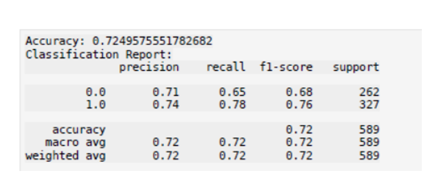
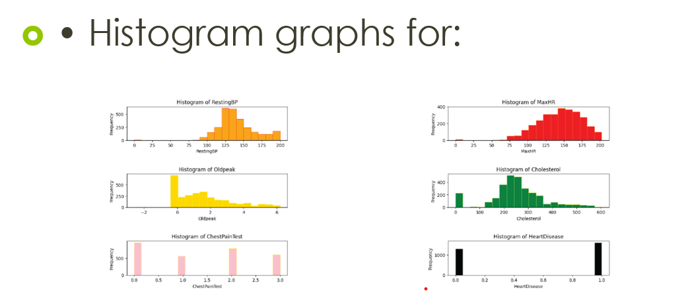

# 🫀 Heart Disease Prediction System

This project predicts the presence of heart disease using machine learning techniques based on patient medical data.

The goal of this project is to apply data analysis and basic machine learning concepts to a real-world healthcare problem.

---

## 📌 Dataset
- The dataset is stored in CSV format
- Contains medical attributes such as age, cholesterol, blood pressure, etc.

---

## 🧠 Approach
- Data preprocessing and cleaning
- Exploratory Data Analysis (EDA)
- Feature selection
- Model training and evaluation

---

## 🛠 Tech Stack
- Python
- Jupyter Notebook
- Pandas
- NumPy
- Matplotlib / Seaborn
- Scikit-learn

---

## ▶️ How to Run
1. Clone the repository
2. Open the notebook file
3. Run cells sequentially

---

## 📸 Screenshots

### 🔹 Model Output (KNN)

### 🔹 Data Analysis & Visualization

---

## 📈 Results
- Evaluated model performance using accuracy and other metrics
- Compared results of different machine learning algorithms

---

## 📌 Future Improvements
- Improve model accuracy
- Add more evaluation metrics
- Deploy using a web interface

---

## 📄 License
This project is open-source and available under the MIT License.
